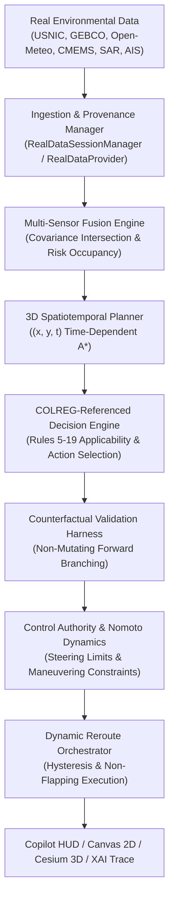

# POLARIS — FINAL JUDGE BRIEF & SYSTEM SUMMARY

> **Official Approved Final Claim**:
> "POLARIS is an evidence-backed, real-data-connected autonomous navigation software digital twin that ingests public Antarctic environmental and maritime datasets, fuses them with uncertainty, performs time-dependent planning and COLREG-referenced decision support, validates candidate actions in simulation, and dynamically reroutes while exposing complete decision provenance."

---

## 1. WHAT POLARIS IS
POLARIS (Polar Autonomous Navigation OS) is a software digital twin and decision-support stack designed for polar maritime navigation. It operates entirely as a browser-based, client-side digital twin and simulation testbed. POLARIS ingests real public environmental datasets (icebergs, bathymetry, weather, currents, SAR satellite metadata, and AIS tracks) and provides continuous spatiotemporal risk evaluation, COLREG-referenced decision support, candidate action validation via counterfactual simulation, and dynamic route adaptation.

**Scope & Hardware Boundary**:
POLARIS is **100% software, simulation, and replay**. It includes **0 physical sensor interfaces** (no NMEA 0183/2000, CAN bus, serial ports, or radar transceivers). POLARIS is NOT an physical vessel controller, is NOT sea-trial validated, and is NOT IMO-certified.

---

## 2. WHAT DATA IT CONSUMES
POLARIS ingests real public external data across six primary channels:
1. **USNIC Antarctic Iceberg Tracking Data**: Official National Ice Center tracked iceberg polygons and point contacts (e.g., `USNIC-A68A`, `USNIC-B15A`, `USNIC-C19B`) with historical track histories and drift vectors.
2. **GEBCO 2023 Bathymetric Grid**: Global bathymetric depth grid used to construct depth contours, enforce vessel draft limits, and calculate grounding risk.
3. **Open-Meteo Antarctic Weather API**: High-resolution wind speed, direction, wave height, and surface atmospheric pressure forcing fields.
4. **Copernicus Marine Service (CMEMS)**: Surface ocean current velocity vectors ($u, v$ components) for hydrodynamic drift calculation and fuel optimization.
5. **Copernicus Data Space Ecosystem (CDSE) Sentinel-1 SAR**: OData STAC catalogue discovery metadata and real GeoTIFF SAR decibel backscatter rasters (`S1A_IW_GRDH_1SDV_20260927T120000`) processed via CFAR detection and PyTorch U-Net semantic segmentation.
6. **Historical AIS Maritime Replay**: Real MMSI target tracks (e.g., `MMSI 316001234`) providing target position, SOG, COG, and heading for multi-vessel encounter scenarios.

---

## 3. HOW DATA FLOWS THROUGH THE ARCHITECTURE

---

## 4. HOW PLANNING WORKS
Path planning is performed by a **3D Spatiotemporal $(x, y, t)$ A* Search Engine**:
- **Time-Dependent Occupancy**: Evaluates static obstacles (bathymetry, coastlines) and dynamic hazards (drifting icebergs, moving AIS vessels) at specific future arrival timestamps $t$.
- **Cost Function**: Minimizes a composite cost $J = w_d \cdot \text{distance} + w_r \cdot \text{risk}(x,y,t) + w_f \cdot \text{fuel}(u,v) + w_c \cdot \text{turning\_cost}$.
- **Kinematic & Depth Guards**: Enforces vessel minimum depth clearance (draft + safety margin) and turning radius limits via curvature smoothing.

---

## 5. HOW COLREG-REFERENCED DECISIONS WORK
When an AIS target encounter is detected within the safety horizon:
1. **Encounter Geometry Classification**: Calculates Closest Point of Approach (CPA), Time to CPA (TCPA), relative bearing, and heading difference to classify the situation into Head-on (Rule 14), Crossing (Rule 15/17), or Overtaking (Rule 13).
2. **Priority Arbitration**: Resolves hazard precedence using deterministic rule hierarchy.
3. **Safe Action Selection**: Recommends starboard course alterations or speed adjustments derived from COLREG guidance.
4. **Terminology Constraint**: POLARIS generates **COLREG-referenced action proposals** for bridge human oversight. It does NOT claim automated legal compliance or IMO certification.

---

## 6. HOW COUNTERFACTUAL VALIDATION WORKS
Before adopting a proposed maneuver, POLARIS executes a **Non-Mutating Counterfactual Simulation**:
- Clones the current vessel state and projects candidate maneuvers (e.g., Maintain Course, Starboard $15^\circ$, Speed Reduction $30\%$) forward across a 15-minute horizon.
- Evaluates minimum passing distance, predicted collision risk, and hydrodynamic stability for each candidate branch.
- Rejects candidate actions that violate safety thresholds or induce instability.

---

## 7. HOW DYNAMIC REROUTING WORKS
Dynamic rerouting operates in a closed loop:
- **Continuous Monitoring**: Tracks real-time distance to active path and sensor drift.
- **Hysteresis Guard**: Requires a minimum cost improvement threshold ($\ge 15\%$) and commitment window to commit to a new route, preventing high-frequency route oscillation ("flapping").
- **Atomic Route Swapping**: Replaces the active trajectory seamlessly without telemetry discontinuities.

---

## 8. HOW XAI WORKS
The Explainable AI (XAI) engine converts multi-sensor fusion states, hazard classifications, and decision logic into auditable, human-readable natural language explanations:
- **Clean Hazard Differentiation**: Explicitly separates static/drifting ice hazards (e.g., `USNIC-A68A`) from moving vessel encounters (e.g., AIS target `MMSI 316001234`).
- **Rule Citations**: Cites specific COLREG-referenced rules and safety threshold metrics (CPA/TCPA/Depth margin).
- **Auditability**: Every generated sentence is backed by verified execution trace data.

---

## 9. WHAT WAS ACTUALLY BENCHMARKED
The POLARIS benchmark suite evaluates **44 Connected Software Capabilities** across 20 standardized test scenarios:
- **100% Passing Unit & Integration Tests**: 140 vitest tests covering bathymetry, Nomoto maneuvering dynamics, SAR perception, spatiotemporal risk, COLREG arbitration, counterfactual stability, and dynamic rerouting.
- **Real-Data Integration Harness**: Tested against 6 real USNIC Antarctic iceberg records, GEBCO bathymetric grids, Open-Meteo weather forcing, CMEMS currents, real AIS track replay, and Sentinel-1 SAR catalogue metadata.

---

## 10. WHAT IS NOT VALIDATED
To maintain absolute evidence credibility, POLARIS explicitly documents what is NOT validated:
- **Physical Hardware**: No physical sensors, transceivers, GNSS units, or steering actuators were connected or tested.
- **Physical Sea Trials**: No actual vessel at sea has been steered by this software.
- **Regulatory Certification**: POLARIS has not been submitted to DNV, IMO, or national maritime authorities for type approval or statutory certification.
- **Offline Docker Container**: Docker build configuration is present, but local Docker daemon runtime verification is marked as `OPTIONAL_RUNTIME_NOT_VERIFIED`.

---

## 11. EXACT DEMO SEQUENCE
When presenting POLARIS:
1. **Launch App**: Open browser application (`index.html`) displaying 2D HTML5 Canvas or 3D CesiumJS globe.
2. **Start Real-Data Session**: Initialize `REAL_SESSION_1790529292000` (ingesting real USNIC icebergs, GEBCO grid, Open-Meteo weather, and real AIS tracks).
3. **Inspect Session Provenance**: Confirm HUD session badge displays `REAL_DATA_MIXED` / `REAL_REPLAY` with per-provider health status.
4. **Observe Initial Route**: View initial 3D spatiotemporal path navigating around GEBCO shallow bathymetry and `USNIC-A68A` iceberg contact.
5. **Trigger AIS Encounter**: Introduce AIS target vessel `MMSI 316001234` on a starboard crossing trajectory.
6. **Review Decision & XAI Trace**: Observe COLREG-referenced Rule 15 crossing classification, candidate counterfactual evaluation, and natural language XAI output.
7. **Verify Dynamic Reroute**: Watch POLARIS smoothly adopt a starboard evasive maneuver and return to destination without route flapping.
