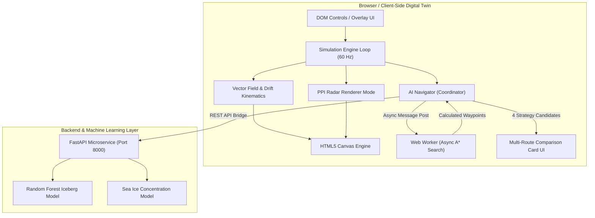
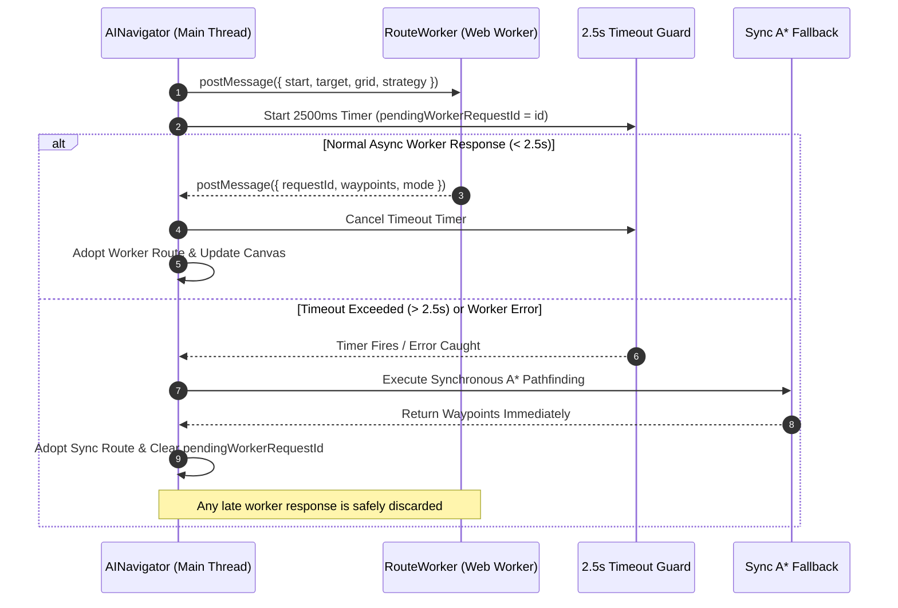

# ⚓ POLARIS — Autonomous Polar Navigation & Hazard Avoidance Digital Twin

> **A real-time, browser-based digital twin and autonomous pathfinding system for polar vessel navigation through dynamic sea ice, ocean drift currents, and drifting icebergs.**

[](https://polaris-sigma-eight.vercel.app)
[](docs/FRONTEND.md)
[](docs/TESTING.md)
[](#license)

---

## 🌟 Executive Overview

**POLARIS** (Polar Operations & Location-Aware Route Intelligence System) is an interactive maritime digital twin designed for navigating harsh polar environments. It combines high-resolution continuous vector field drift physics, offloaded Web Worker pathfinding, multi-strategy route optimization, real-time Plan Position Indicator (PPI) radar rendering, and machine learning trajectory predictions to evaluate safe, fuel-efficient maritime routes around drifting ice hazards.

---

## ✨ Key Capabilities

| Feature | Description | Architecture / Source |
| :--- | :--- | :--- |
| ⚡ **Web Worker Pathfinding** | Asynchronous A* grid search offloaded to a background thread with zero main-thread frame stutter. Features a **2.5s fallback timer** for synchronous fallback if workers fail. | [`src/js/workers/routeWorker.js`](src/js/workers/routeWorker.js) |
| 🛡️ **Replan Storm Guard** | Prevents request flooding by tracking active requests (`pendingWorkerRequestId`), suppressing redundant path recalculations while worker calculation is pending. | [`src/js/ai/aiNavigator.js`](src/js/ai/aiNavigator.js) |
| 📡 **PPI Radar Monitor Display** | Realistic 30 RPM rotating sweep radar view mode with phosphor-green aesthetic, contact target blips, range rings, cardinal headings, and dynamic vessel readout. | [`src/js/render/canvasRenderer.js`](src/js/render/canvasRenderer.js#L1542) |
| 📊 **Multi-Route Comparison UI** | Displays side-by-side route option cards (`ROUTE A` to `ROUTE D`) comparing Distance, Time, Fuel Remaining %, and Collision Risk %, driven by rule-based weighted decision scoring. | [`src/js/ui/routeComparisonUI.js`](src/js/ui/routeComparisonUI.js) |
| 🌊 **Vector Drift Physics** | Simulates continuous sea-ice concentration grids, wind velocity drag, Perlin-noise ocean currents, and dynamic iceberg drift kinematics. | [`src/js/simulation/vectorField.js`](src/js/simulation/vectorField.js) |
| 🧠 **ML Trajectory Forecasting** | Python FastAPI microservice providing Random Forest trajectory forecasts (+2h to +24h horizons) and sea-ice concentration growth predictions. | [`backend/main.py`](backend/main.py) |

---

## 🏗️ System Architecture

### 1. High-Level Architecture Flow



### 2. Web Worker Asynchronous Pathfinding & Fallback Execution



---

## 📁 Repository Structure

```
POLARIS/
├── index.html                     # Main SPA entry point & UI overlay layout
├── package.json                   # Dependencies, Vite scripts & Vitest runner
├── vercel.json                    # Vercel deployment configuration
├── backend/                       # Python FastAPI microservices
│   ├── main.py                    # API entry point & prediction routes
│   ├── train.py                   # Iceberg trajectory model trainer
│   └── train_sea_ice.py           # Sea ice forecast model trainer
├── data/                          # Antarctic synthetic datasets & calibration
│   ├── antarctic/                 # Sea ice, ocean currents, wind & iceberg tracks
│   ├── routeCalibration.json      # Speed & fuel burn baseline configs
│   └── uncertaintyCalibration.json# Confidence interval thresholds
├── src/
│   ├── css/                       # Theme styles & glassmorphism overlays
│   └── js/
│       ├── main.js                # Core simulation orchestrator & loop
│       ├── ai/                    # Autonomous decision & navigation logic
│       │   ├── aiNavigator.js     # Pathfinding coordinator & fallback manager
│       │   ├── decisionEngine.js  # Weighted multi-factor candidate evaluator
│       │   └── confidenceIntelligenceEngine.js # Uncertainty estimator
│       ├── render/
│       │   └── canvasRenderer.js  # Top-down map & PPI Radar canvas renderer
│       ├── simulation/            # Hydrodynamics & drift kinematics
│       │   ├── ship.js            # Vessel physics, steering & fuel burn
│       │   ├── iceberg.js         # Iceberg drift & bounding collision envelopes
│       │   └── vectorField.js     # Ocean current grid & wind vector field
│       ├── ui/                    # User interface management
│       │   ├── uiController.js    # Overlay controls & event listeners
│       │   ├── featurePanel.js    # NAV PANEL sidebar manager
│       │   └── routeComparisonUI.js # Multi-route choice cards & recommendation
│       └── workers/
│           └── routeWorker.js     # Web Worker background A* pathfinding
├── tests/                         # Vitest automated test suite (33+ test files)
└── docs/                          # Detailed system documentation index
```

---

## 💻 Tech Stack

- **Frontend Core:** JavaScript (ES6+ Modules), HTML5 Canvas 2D API, CSS3
- **Build & Dev Tooling:** Vite, Vitest
- **Parallel Computing:** Web Workers API
- **Backend Microservices:** Python 3.10+, FastAPI, Uvicorn
- **Machine Learning:** Scikit-Learn (Random Forest Regressors), NumPy, Pandas
- **Deployment:** Vercel (Production static SPA host)

---

## ⚡ Quick Start & Setup

### Prerequisites
- **Node.js**: v18.0.0 or higher
- **Python**: v3.10+ (Optional, for backend ML microservice)

### 1. Clone & Install Dependencies
```bash
git clone https://github.com/Saptarshi-Adhikari/POLARIS.git
cd POLARIS
npm install
```

### 2. Run Frontend Development Server
```bash
npm run dev
```
Open your browser at `http://localhost:5173`.

### 3. Run Automated Unit & Integration Tests
```bash
npx vitest run
```

### 4. (Optional) Run Python FastAPI ML Microservice
```bash
python -m venv venv
# On Windows: venv\Scripts\activate | On Unix: source venv/bin/activate
pip install fastapi uvicorn scikit-learn numpy pandas
python -m uvicorn backend.main:app --reload --port 8000
```

---

## 🌐 Live Production Deployment

POLARIS is continuously deployed to Vercel:
🔗 **[https://polaris-sigma-eight.vercel.app](https://polaris-sigma-eight.vercel.app)**

---

## 📚 System Documentation Index

For detailed technical specifications, architectural audits, and module breakdowns, refer to the [`docs/`](docs/) directory:

- 📖 [`ASTRALIS_PROJECT_KNOWLEDGE.md`](docs/ASTRALIS_PROJECT_KNOWLEDGE.md): Master system knowledge base & feature specs.
- 📐 [`ARCHITECTURE.md`](docs/ARCHITECTURE.md): Component diagrams & data flow models.
- 🗺️ [`CODEBASE_MAP.md`](docs/CODEBASE_MAP.md): Directory & file responsibility index.
- 🎨 [`FRONTEND.md`](docs/FRONTEND.md): Canvas rendering, PPI radar, & UI layout guide.
- 🔀 [`ROUTING.md`](docs/ROUTING.md): Web Worker A* pathfinding & storm prevention logic.
- ⚙️ [`BACKEND.md`](docs/BACKEND.md): Python FastAPI microservices & ML inference endpoints.
- 📊 [`DATA.md`](docs/DATA.md): Antarctic synthetic dataset specifications.
- 🧪 [`TESTING.md`](docs/TESTING.md): Vitest test suite breakdown & coverage verification.
- 📊 [`STATUS.md`](docs/STATUS.md): System maturity & capability matrix.

---

## 📜 License

This project is licensed under the [MIT License](LICENSE).
