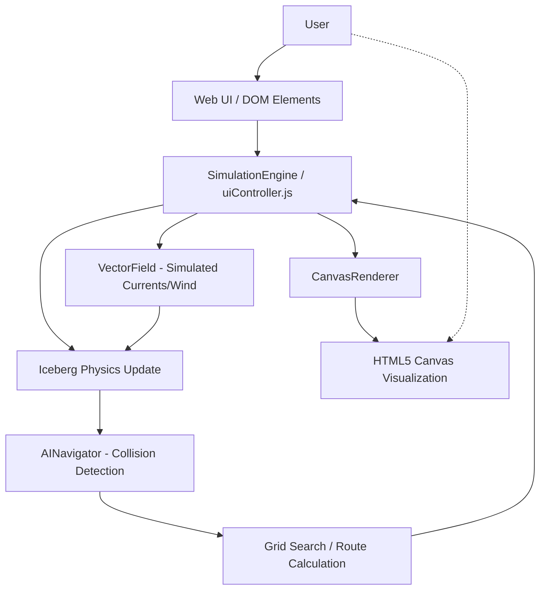
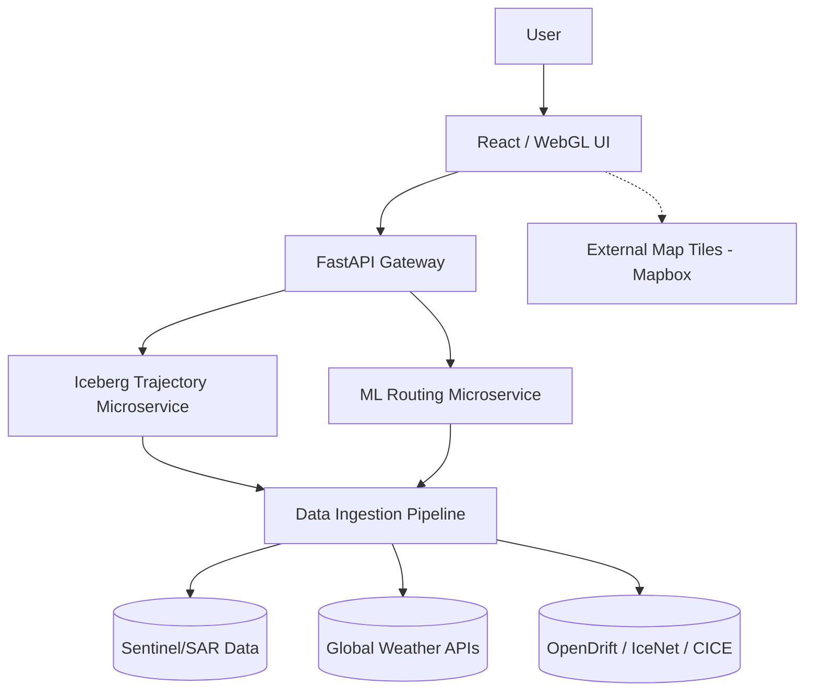

# Architecture

## CURRENT ARCHITECTURE

```mermaid
graph TD
    User[User] --> UI[Web UI / DOM Elements]
    UI --> SimControl[SimulationEngine / uiController.js]
    SimControl --> Environment[VectorField - Simulated Currents/Wind]
    SimControl --> Hazard[Iceberg Physics Update]
    Environment --> Hazard
    Hazard --> AILayer[AINavigator - Collision Detection]
    AILayer --> Pathfinding[Grid Search / Route Calculation]
    Pathfinding --> SimControl
    SimControl --> Renderer[CanvasRenderer]
    Renderer --> Canvas[HTML5 Canvas Visualization]
    User -.-> Canvas
```

## TARGET ARCHITECTURE (FUTURE/PLANNED)

```mermaid
graph TD
    User[User] --> Frontend[React / WebGL UI]
    Frontend --> API[FastAPI Gateway]
    
    API --> RoutingService[ML Routing Microservice]
    API --> TrajectoryService[Iceberg Trajectory Microservice]
    
    TrajectoryService --> DataIngest[Data Ingestion Pipeline]
    RoutingService --> DataIngest
    
    DataIngest --> Satellites[(Sentinel/SAR Data)]
    DataIngest --> Weather[(Global Weather APIs)]
    DataIngest --> Models[(OpenDrift / IceNet / CICE)]
    
    Frontend -.-> Maps[External Map Tiles - Mapbox]
```
