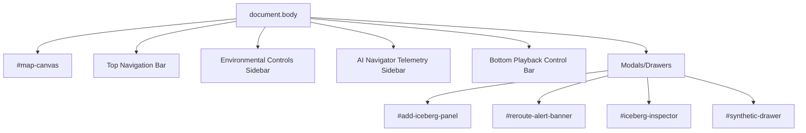

# Frontend Documentation

## 1. Framework
Vanilla HTML5, JavaScript, and Tailwind CSS. Vite is used as a bundler and dev server.

## 2. Entry Point
`index.html` loads ``.

## 3. Component Hierarchy (DOM Based)

## 4. State Management
State is mutable and managed entirely within the `SimulationEngine` class instance created in `main.js`. There is no Redux, Context API, or Vuex. 
- UI state (what drawer is open) is managed by `uiController.js` toggling CSS classes (like `hidden`).
- Simulation state is held in class instances (`vectorField`, `ship`, `icebergs`).

## 5. Rendering Approach
- **Map/Graphics:** Pure HTML5 Canvas 2D API (`canvasRenderer.js`). Drawn procedurally every frame via `requestAnimationFrame`. No WebGL, Leaflet, or Mapbox.
- **UI Overlay:** Standard HTML elements absolute-positioned over the canvas.

## 6. Event Handling
- DOM events (`click`, `input` for sliders) are bound in `uiController.js`.
- Canvas interactions (clicking an iceberg) are captured via a global click listener on the canvas element, transforming mouse coordinates to canvas coordinates, and doing a distance check against known entity positions (`canvasRenderer.js` -> `main.js` -> `uiController.js`).

## 7. Responsive Behavior
Limited. The layout uses CSS Grid/Flexbox for the sidebars, but resizing the window mid-simulation can desync the canvas drawing context scale from the CSS layout scale.

## 8. Specific UI Elements

- **Environmental Sliders:** 
  - UI text: "WIND SPEED", "CURRENT SPEED"
  - Source: `index.html`, `uiController.js`
  - Logic: Input event updates the corresponding property in `vectorField.js`.
- **Reroute Alert Banner:**
  - UI text: "🚨 EXISTING ROUTE NO LONGER OPTIMAL..."
  - Source: `index.html`, `uiController.js`
  - Logic: Triggered by `uiController.showRerouteAlert()` when the AI recalculates a drastically different path length.
- **Synthetic Data Engine Logs:**
  - UI text: "GENERATED: SCENARIO-X..."
  - Source: `uiController.js`
  - Logic: Simply appends hardcoded DOM strings with randomized numbers when the button is clicked. NO DATA IS ACTUALLY GENERATED.
