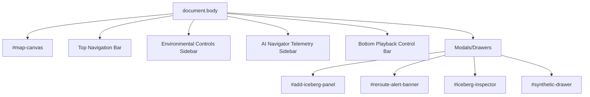

# Frontend Documentation

## 1. Framework
Vanilla HTML5, JavaScript, and Tailwind CSS. Vite is used as a bundler and dev server.

## 2. Entry Point
`index.html` loads ``.

## 3. Component Hierarchy (DOM Based)

## 4. State Management
State is mutable and managed entirely within the `SimulationEngine` class instance created in `main.js`. There is no Redux, Context API, or Vuex. 
- UI state (what drawer is open) is managed by `uiController.js` toggling CSS classes (like `hidden`).
- Simulation state is held in class instances (`vectorField`, `ship`, `icebergs`).

## 5. Rendering Approach
- **Map/Graphics:** Pure HTML5 Canvas 2D API (`canvasRenderer.js`). Drawn procedurally every frame via `requestAnimationFrame`. No WebGL, Leaflet, or Mapbox.
- **UI Overlay:** Standard HTML elements absolute-positioned over the canvas.

## 6. Event Handling
- DOM events (`click`, `input` for sliders) are bound in `uiController.js`.
- Canvas interactions (clicking an iceberg) are captured via a global click listener on the canvas element, transforming mouse coordinates to canvas coordinates, and doing a distance check against known entity positions (`canvasRenderer.js` -> `main.js` -> `uiController.js`).

## 7. Responsive Behavior
Limited. The layout uses CSS Grid/Flexbox for the sidebars, but resizing the window mid-simulation can desync the canvas drawing context scale from the CSS layout scale.

## 8. Specific UI Elements & Render Modes

- **PPI Radar Monitor Display (`drawRadarView`)**:
  - UI Source: `src/js/render/canvasRenderer.js`
  - Logic: Toggled via `📡 RADAR VIEW` button in top overlay bar. Renders ship-centered Plan Position Indicator display with 30 RPM rotating sweep, phosphor green monochrome theme, target blip contacts, range rings, and canvas status readout box at `(x: 16, y: 68)` below top overlay controls.
- **Multi-Route Comparison Cards (`RouteComparisonUI`)**:
  - UI Source: `src/js/ui/routeComparisonUI.js`, `featurePanel.js`, `index.html`
  - Logic: Collapsible details container in NAV PANEL's ROUTE tab rendering 4 candidate route cards (`ROUTE A` to `ROUTE D`) with Distance (km/SU), Time (`Xh Ym`), Fuel (`% remaining`), and Risk (`%`), along with AI Recommendation callout box labeled `"Rule-Based Weighted Scoring"`.
- **Top Surfacing Overlay Controls (`#minimal-overlay-controls`)**:
  - UI Source: `index.html`, `uiController.js`, `aiNavigator.js`
  - Logic: Fixed top-left bar displaying Sea-Ice Trend selector, Iceberg Trajectories checkbox, Active Mode dropdown, Worker Status indicator with trigger breakdown, and RADAR VIEW toggle button.
- **Reroute Alert Banner**:
  - UI text: "🚨 REROUTE RECOMMENDED..."
  - Source: `index.html`, `uiController.js`
  - Logic: Triggered by `uiController.showRerouteAlert()` when a hazard invalidates the active route or high-risk collision is detected.
