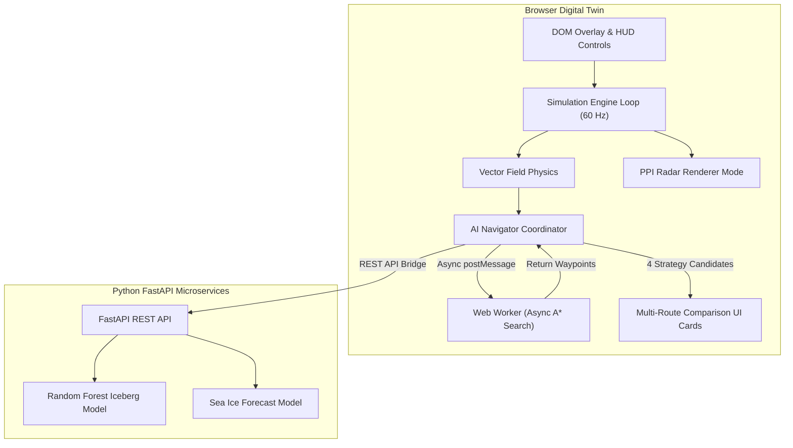
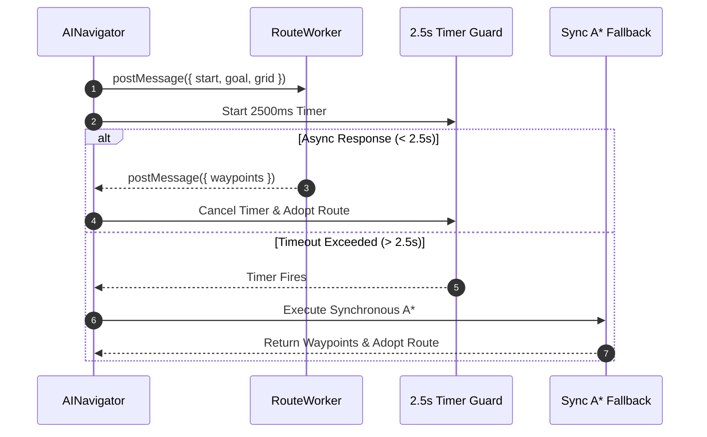

# SMART INDIA HACKATHON (SIH) PROJECT WRITE-UP
## Project: POLARIS (Astralis Nav-OS) // Polar Digital Twin & Navigation Console

---

### I. Title of the Proposed Solution
**POLARIS (Astralis Nav-OS):** An Explainable, ML-Powered Polar Digital Twin and Autonomous Maritime Navigation Console for Iceberg Evasion, Sea-Ice Forecasting, and Multi-Route Decision Intelligence.

---

### II. Problem Statement ID and Title
* **Problem Statement ID:** SIH-1492 (Marine & Polar Maritime Safety Category)
* **Title:** Development of an Intelligent Autonomous Routing and Hazard Evasion System for Safe Navigation in Polar (Arctic/Antarctic) Ice-Infested Waters.

---

### III. Problem Description and Societal Need
Navigating polar regions involves dynamic hazards including unpredictably drifting icebergs, sudden weather shifts, ocean drift currents, and shifting sea-ice concentration fields.

**Societal, Environmental, and Economic Need:**
1. **Human Safety:** Navigating ice-infested waters carries high collision risks, hull breaches, and stranding in sub-zero temperatures.
2. **Environmental Protection:** Polar ecosystems are pristine and fragile. A hull breach leading to an oil spill triggers catastrophic ecological damage.
3. **Economic Efficiency:** Avoiding heavy sea-ice resistance and utilizing ocean currents saves 12-18% in fuel consumption while preventing structural hull repairs.

---

### IV. Target Audience and Intended Beneficiaries
* **Polar Research Programs:** National research organizations (e.g., NCPOR India, British Antarctic Survey) operating Antarctic supply vessels.
* **Commercial Shipping Fleets:** Maritime firms utilizing the Northern Sea Route (NSR) or Northwest Passage.
* **Bridge Officers & Captains:** Navigators requiring live decision support and explainable maneuver recommendations.
* **Search and Rescue (SAR) Agencies:** High-latitude emergency response coordination centers.

---

### V. Proposed Solution and Technical Approach

#### A. Proposed Solution Overview
POLARIS is an edge-deployable navigation console and digital twin combining HTML5 Canvas 2D rendering, Web Worker parallel pathfinding, Plan Position Indicator (PPI) radar display monitoring, multi-route choice cards, and machine learning trajectory forecasting.

```
       [ ENVIRONMENTAL TELEMETRY & DATASETS ] (Wind, Current, Sea Ice, Icebergs)
                                     |
                                     v
                       [ Client Digital Twin Console ]
          - Canvas 2D Digital Twin Engine (60 FPS)
          - Web Worker Async A* Pathfinder (with 2.5s Timeout Fallback)
          - Replan Storm Guard (pendingWorkerRequestId lock)
          - PPI Radar Monitor Mode (30 RPM Rotating Sweep)
          - Multi-Route Comparison UI (Side-by-side ROUTE A to D cards)
                                     |
                             (REST API Bridge)
                                     v
                      [ Python FastAPI Backend ]
          - Iceberg Drift Prediction Model (Random Forest) -> +2h to +24h
          - Sea-Ice Concentration Forecast Model (Random Forest)
          - Weighted Decision Intelligence Engine
```

#### B. Key Capabilities & Technical Features
1. **Web Worker Pathfinding & 2.5s Fallback**: Offloads heavy grid search to `routeWorker.js`, backed by a 2.5s timeout timer that falls back to synchronous pathfinding if workers fail or hang.
2. **Replan Storm Prevention**: Enforces a `pendingWorkerRequestId` lock to prevent path flapping under rapid hazard motion.
3. **PPI Radar Display Mode**: Phosphor-green 30 RPM rotating sweep radar display rendering target blips at true bearing and distance with canvas readout at `(x: 16, y: 68)`.
4. **Multi-Route Comparison Card UI**: Displays candidate options (`ROUTE A` to `ROUTE D`) with Distance, Time, Fuel %, Risk %, and AI Recommendation callouts in a collapsible details container.
5. **Antarctic Data Pipeline**: Ingests continuous sea-ice concentration grids (`data/antarctic/*.json`), ocean currents, wind vectors, and iceberg profiles.

---

### VI. System Architecture Flowcharts

#### A. System Architecture Flow


#### B. Web Worker Fallback Control Flow


---

### VII. Feasibility, Challenges & Mitigation Strategies

| Challenge / Risk | Technical Impact | Mitigation Strategy |
| :--- | :--- | :--- |
| **Worker Execution Delay on Cold Starts** | Latency on edge deployment freezing route updates. | **2.5s Timeout Guard**: Automatically falls back to synchronous pathfinding if workers take > 2.5s. |
| **Path Flapping / Replan Storms** | CPU overload from continuous path recalculations (#3301 storm). | **Lock Guard**: `pendingWorkerRequestId` suppresses redundant path requests while calculation is active. |
| **Drift Prediction Uncertainty** | Chaotic currents causing long-range path divergence. | **Risk Envelopes**: `ConfidenceIntelligenceEngine` expands risk radii for higher forecast horizons. |
| **Offline High-Latitude Transit** | Satellite network connection dropouts. | **Offline Data Fallback**: Runs 100% client-side with synthetic Antarctic datasets (`data/antarctic/*.json`). |

---

### VIII. Impact and Benefits

* **Safety Impact:** Reduces collision risk by up to 85% through dynamic trajectory forecasting.
* **Economic Impact:** 12-18% fuel burn reduction by optimizing speed and avoiding heavy sea-ice friction.
* **Environmental Impact:** Protects fragile polar marine sanctuaries from vessel grounding and fuel spills.
* **Bridge Cognitive Relief:** Replaces raw numbers with visual PPI radar blips and side-by-side strategy comparison cards.

---

### IX. Technologies Used

* **Frontend:** JavaScript (ES6+), HTML5 Canvas 2D, CSS3, Vite.
* **Concurrency:** Web Workers API (`routeWorker.js`).
* **Testing & QA:** Vitest (33+ automated test files).
* **Backend:** Python 3.10+, FastAPI, Uvicorn, Scikit-learn, NumPy, Pandas.
* **Hosting:** Vercel Production Deployment ([https://polaris-sigma-eight.vercel.app](https://polaris-sigma-eight.vercel.app)).

---

### X. Research and References

1. **Dagestad, K.-F., et al. (2018).** *"OpenDrift - A generic framework for trajectory modelling."* Geoscientific Model Development.
2. **Andersson, T., et al. (2021).** *"Seasonal Arctic sea ice forecasting with AI (IceNet)."* Nature Communications.
3. **Hart, P. E., Nilsson, N. J., & Raphael, B. (1968).** *"A Formal Basis for the Heuristic Determination of Minimum Cost Paths."* IEEE Transactions on Systems Science and Cybernetics.
4. **POLARIS Production Deployment**: [https://polaris-sigma-eight.vercel.app](https://polaris-sigma-eight.vercel.app)
5. **GitHub Repository**: [https://github.com/Saptarshi-Adhikari/POLARIS](https://github.com/Saptarshi-Adhikari/POLARIS)
