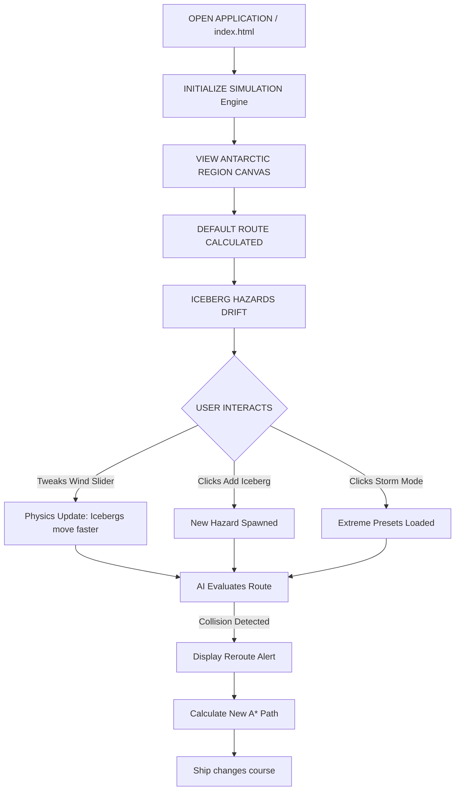

# User Flow

```mermaid
graph TD
    OPEN[OPEN APPLICATION / index.html] --> INIT[INITIALIZE SIMULATION Engine]
    INIT --> VIEW[VIEW ANTARCTIC REGION CANVAS]
    VIEW --> ROUTE[DEFAULT ROUTE CALCULATED]
    ROUTE --> HAZARDS[ICEBERG HAZARDS DRIFT]
    HAZARDS --> INTERACT{USER INTERACTS}
    
    INTERACT -->|Tweaks Wind Slider| UPDATE_PHYSICS[Physics Update: Icebergs move faster]
    INTERACT -->|Clicks Add Iceberg| SPAWN[New Hazard Spawned]
    INTERACT -->|Clicks Storm Mode| PRESET[Extreme Presets Loaded]
    
    UPDATE_PHYSICS --> AI_EVAL[AI Evaluates Route]
    SPAWN --> AI_EVAL
    PRESET --> AI_EVAL
    
    AI_EVAL -->|Collision Detected| ALERT[Display Reroute Alert]
    ALERT --> RECALC[Calculate New A* Path]
    RECALC --> RESULT[Ship changes course]
```
