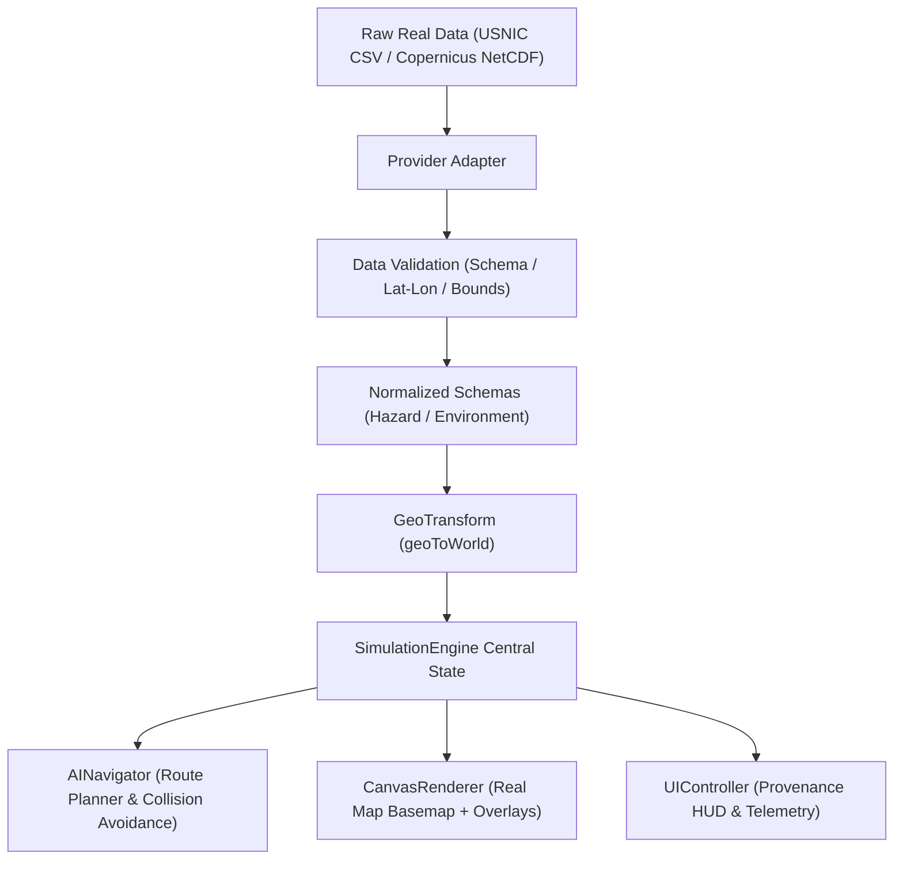

# 01 — POLARIS Real Data Overview

## 1. Introduction & Objectives
POLARIS is an interactive digital twin designed for autonomous polar vessel navigation. Operating in extreme high-latitude environments requires evaluating vessel routes against real maritime observations (icebergs, sea-ice concentration fields, ocean current hydrodynamics, and wind vector fields).

This document provides a comprehensive overview of **REAL DATA MODE** in POLARIS, detailing how real data transforms the information source while preserving the exact same safety and navigation core.

---

## 2. Modes of Operation

POLARIS defines three distinct operational modes:

### A. DEMO MODE `[CURRENT]`
- **Description**: Fully synthetic simulation environment.
- **Icebergs**: Generated via seeded LCG pseudo-random distribution algorithm.
- **Environment**: Mathematically generated ocean current grid and wind drag vectors.
- **Map Background**: Synthetic polar ocean grid canvas.
- **Purpose**: Interactive demonstration, zero-dependency offline sandbox testing.

### B. REAL HISTORICAL REPLAY `[CURRENT]`
- **Description**: Historical real maritime data replay mode using deterministic local snapshots.
- **Icebergs**: Real observed Antarctic iceberg positions from USNIC (U.S. National Ice Center).
- **Environment**: Ocean physics reanalysis currents and ERA5 wind vectors.
- **Map Background**: Real Southern Ocean / Antarctic Peninsula geographic basemap.
- **Purpose**: Scientifically valid evaluation, deterministic judging demos, offline-safe competition presentation.

### C. REAL LIVE STREAM `[FUTURE]`
- **Description**: Real-time authenticated streaming mode via REST / WebSockets.
- **Icebergs**: Live operational feeds from USNIC / Sentinel-1 SAR pipeline.
- **Environment**: Near-Real-Time (NRT) Copernicus Marine forecast API.
- **Map Background**: Interactive vector tile MapLibre GL JS basemap.
- **Purpose**: Real-world operational deployment on polar research vessels.

---

## 3. What Changes vs. What Remains Constant

```
                      POLARIS ARCHITECTURE BOUNDARY
                                     │
           ┌─────────────────────────┴─────────────────────────┐
           ▼                                                   ▼
     WHAT CHANGES                                    WHAT STAYS CONSTANT
 (Data Source & Basemap)                             (Safety Core & Physics)

 • Iceberg Position Origin                        • A* Web Worker Pathfinder (`routeWorker.js`)
   (Synthetic → USNIC Lat/Lon)                    • Replan Storm Guard (`pendingWorkerRequestId`)
 • Hydrodynamics                                  • Nomoto Ship Dynamics & Steering (`Ship`)
   (Euler Math → Copernicus/ERA5)                 • Continuous Collision Avoidance
 • Canvas Background                              • Green Active Route Rendering (`activeRoute`)
   (Polar Grid → Southern Ocean Map)              • Multi-Route Comparison UI Cards
 • Telemetry Display                              • Risk Level Heatmap & Safety Envelopes
   (Sim Time → UTC Timestamp)                     • NavTestBot & EpisodeRunner (`Shift+F6`)
```

---

## 4. End-to-End Data Pipeline Flow



---

## 5. Summary of Key Architectural Decisions
1. **Historical Replay for Competition**: Historical replay is chosen for hackathon presentation because it guarantees 100% deterministic performance without relying on external API uptime or network keys.
2. **Provider Isolation**: The pathfinder and collision engine consume normalized `Hazard` objects and never reference external raw formats directly.
3. **Transparent Provenance**: REAL mode visibly exposes the source (`USNIC / Copernicus`), observation timestamp, and replay state in the top HUD.
