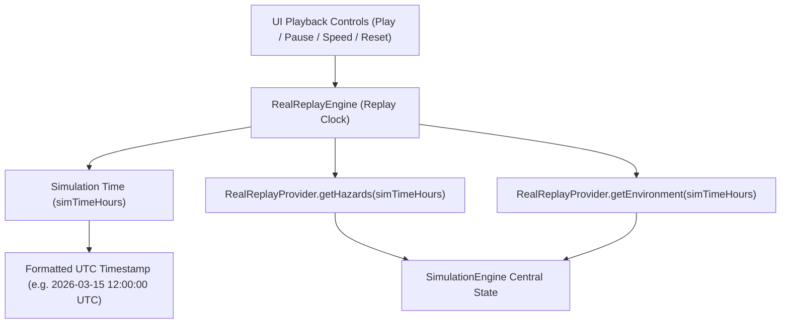

# 09 — POLARIS Real Replay System

## 1. Overview
For hackathons, scientific reviews, and offline demonstrations, **REAL HISTORICAL REPLAY** is the primary recommended implementation for REAL DATA MODE. It provides deterministic, reproducible execution without relying on live external APIs.

---

## 2. Replay Clock Architecture

---

## 3. Playback Synchronization & Controls
The replay clock synchronizes three data channels:
1. **Iceberg Contacts**: Real USNIC iceberg observations updated at current replay step.
2. **Environment Hydrodynamics**: Copernicus ocean currents and ERA5 wind vectors interpolated to current step.
3. **Vessel Position**: Nomoto ship controller advancing along active route.

Replay Controls:
- **Play / Pause**: Toggles clock advancement.
- **Speed Multiplier**: Supports `1x`, `10x`, `100x` time warp.
- **Reset**: Resets replay clock to initial dataset timestamp (`14:00:00 UTC`).

---

## 4. Interpolation & Gap Handling
- **Observed Contacts**: If iceberg observation timestamps are spaced 6 hours apart, linear interpolation $\text{Pos}(t) = \text{Pos}_0 + \mathbf{v} \cdot \Delta t$ steps positions smoothly without visual jumps.
- **Missing Data**: If an environmental slice is missing, the replay engine holds the last valid vector state and marks `confidence` accordingly.
