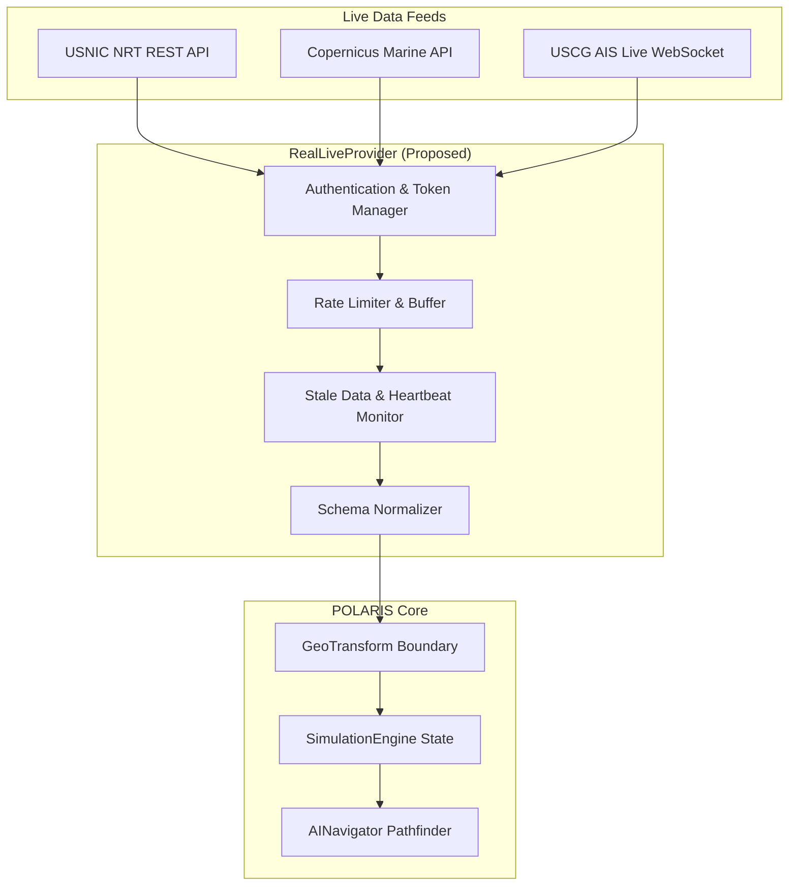

# 10 — POLARIS Real Live Data Architecture `[FUTURE / PROPOSED]`

## 1. Executive Summary
This document specifies the future proposed architecture for ingesting live streaming operational maritime data (USNIC NRT icebergs, Copernicus Marine Live API, and USCG AIS vessel feeds) via REST and WebSockets.

---

## 2. Live Data Ingestion Pipeline

---

## 3. Resilience, Reconnection & Buffering
1. **Network Disconnection**: If WebSocket disconnects, `RealLiveProvider` enters `BUFFERING` state and attempts exponential backoff reconnection.
2. **Stale Observation Guard**: If live hazard updates stop arriving for $> 15$ minutes, hazards are flagged `STALE` and uncertainty search envelopes expand.
3. **Fallback**: Offers explicit user option to transition to `REAL HISTORICAL REPLAY`.
