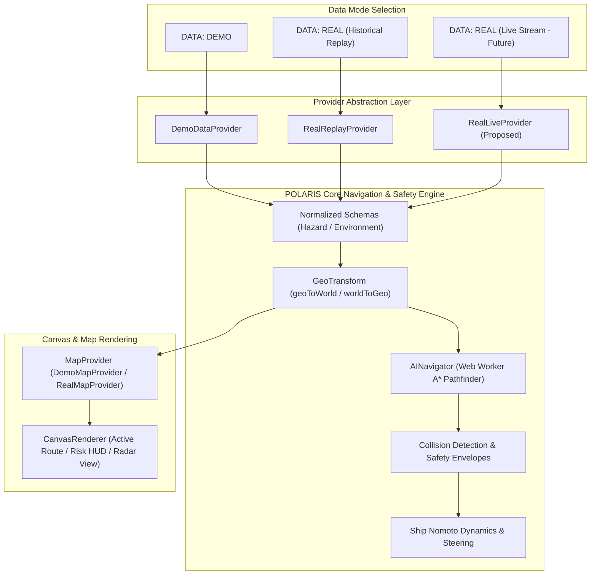

# POLARIS Real Data & Real Maps Documentation Package

Welcome to the comprehensive technical documentation package for **POLARIS Data Mode Architecture: DEMO ↔ REAL Data Ingestion, Historical Replay, & Real Geographic Maps**.

---

## 📌 Status Classification Terminology

Throughout this documentation package, all system features, capabilities, and data providers are explicitly categorized using the following status badges:

- `[CURRENT]` / `[VERIFIED]`: Feature is implemented and verified in the active POLARIS codebase.
- `[PROPOSED]`: Architecture or provider design proposed for upcoming milestone implementation.
- `[FUTURE]`: Long-term extension point (e.g. live authenticated streaming feeds, Sentinel-1 SAR ingestion).
- `[SOURCE-DEPENDENT]`: Behavior depends on third-party API availability, rate limits, or licensing.

---

## 🗺️ Recommended Reading Order

1. **[00-REAL-DATA-MASTER-DOCUMENT.md](00-REAL-DATA-MASTER-DOCUMENT.md)**: Master executive & architectural summary linking to all specialized documents.
2. **[01-real-data-overview.md](01-real-data-overview.md)**: High-level overview of DEMO vs REAL modes, historical replay, and core design principles.
3. **[02-real-data-integration-guide.md](02-real-data-integration-guide.md)**: Main technical integration guide for `DataProvider` and `MapProvider` abstraction layers.
4. **[03-real-map-architecture.md](03-real-map-architecture.md)**: Geographic map rendering stack, OpenStreetMap / MapLibre integration, and visual layer composition.
5. **[04-coordinate-systems-and-georeferencing.md](04-coordinate-systems-and-georeferencing.md)**: Technical guide to POLARIS world coordinates `(0..3600 x 0..2400)` vs. Geographic `(Latitude, Longitude)` transformations.
6. **[05-real-data-sources.md](05-real-data-sources.md)**: Detailed source-by-source audit (USNIC, Copernicus Marine, ERA5, Sentinel-1, AIS, OSM, and IDD note).
7. **[06-real-data-formats.md](06-real-data-formats.md)**: Ingestion format specifications (GeoJSON, CSV, NetCDF, GRIB, GeoTIFF, REST, WebSocket).
8. **[07-normalized-data-model.md](07-normalized-data-model.md)**: Canonical normalized schemas (`Hazard`, `Environment`, `VesselObservation`, `DatasetManifest`).
9. **[08-real-mode-ui-specification.md](08-real-mode-ui-specification.md)**: UI overlay specification, `DATA: [ DEMO | REAL ]` toggle, and Provenance HUD.
10. **[09-real-replay-system.md](09-real-replay-system.md)**: Deterministic historical replay engine and timestamp stepping.
11. **[10-real-live-data-architecture.md](10-real-live-data-architecture.md)**: Future live streaming data architecture (WebSockets, authentication, reconnect, buffering).
12. **[11-data-provenance-and-quality.md](11-data-provenance-and-quality.md)**: Formal data quality, validation, and provenance metadata specifications.
13. **[12-real-mode-safety-and-navigation.md](12-real-mode-safety-and-navigation.md)**: Safety architecture integration (same A* planner, Nomoto ship physics, and collision checks).
14. **[13-demo-vs-real-comparison.md](13-demo-vs-real-comparison.md)**: Side-by-side comparison matrix across DEMO, REAL REPLAY, and REAL LIVE modes.
15. **[14-real-data-implementation-roadmap.md](14-real-data-implementation-roadmap.md)**: Phased implementation roadmap (Phases 1 through 8).
16. **[15-real-data-quickstart.md](15-real-data-quickstart.md)**: Developer quickstart guide for normalizing and adding new real datasets.
17. **[16-real-data-source-matrix.md](16-real-data-source-matrix.md)**: Comprehensive data source evaluation matrix.
18. **[17-real-data-faq.md](17-real-data-faq.md)**: Frequently asked technical & operational questions.
19. **[18-real-data-reference-library.md](18-real-data-reference-library.md)**: Annotated reference library with clickable documentation links.

---

## 🏗️ Core Architecture Overview

> **Central Design Principle**: REAL mode changes the **DATA SOURCE**, not the **SAFETY & NAVIGATION ARCHITECTURE**.
